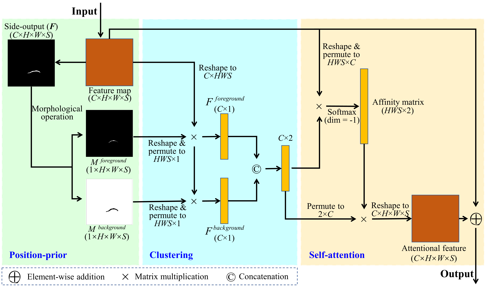
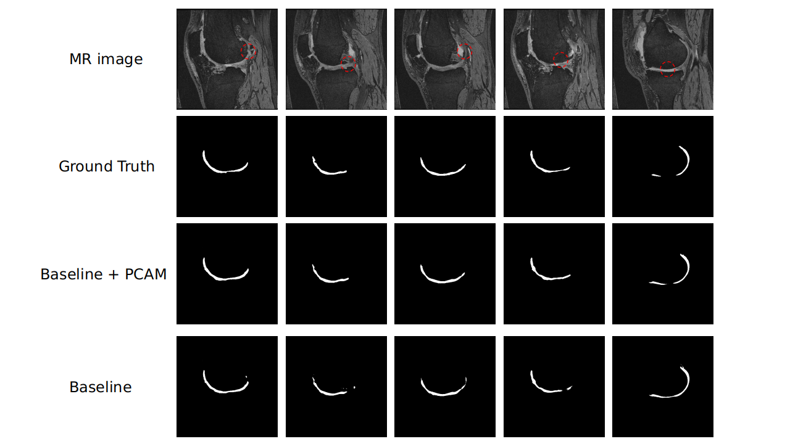
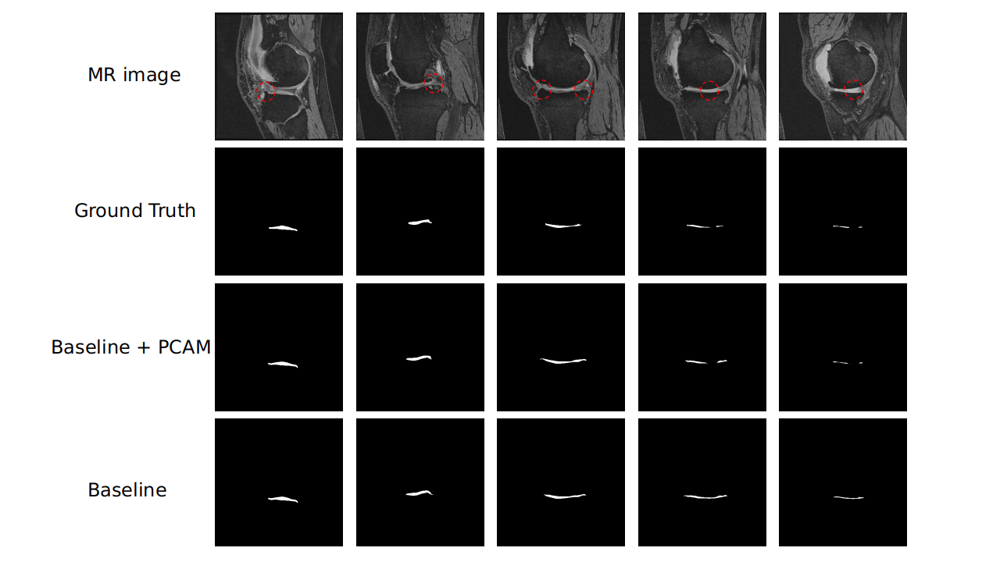

# PCAMNet
Code for paper "Position-Prior Clustering-based Self-attention module for Knee Cartilage Segmentation". 

The framework of PCAM is shown below:

     

## Requirements

Python 3.6.2

Pytorch 1.7

CUDA 11.2

Numpy 1.19.1

SimpleITK 2.1.1.2
## Data process

The model was trained and evaluated on OAI-ZIB Datasets. This public dataset includes 507 3D DESS MR data with 81120 slices. The pixel spacing is 0.3645mm $\times$ 0.3645mm and the slice thickness is 0.7mm for all volumetric data. For each volumetric data, it contains 160 slices in 384 $\times$ 384.

For data preprocess, each volume data is cropped into $256\times256$ in center position along the height and width dimension and is cropped randomly along depth (slice) dimension into $32$. The finally data size is $256\times256\times32$.

Our segmentation model is evaluated by four evaluation metrics, which are **Dice score**, **Volumetirc Overlap Error (VOE)**,  **Average Symmetric Surface Distance (ASSD)**. We performed experiments to evaluate the performance of the proposed model. Please refer to the original paper for more details.

##result

    

    

## Cite

Please consider citing this project in your publications if it helps your research. The following is a BibTeX reference. The BibTeX entry requires the url LaTeX package.

    @article{liang2022pcam,
      title={Position-Prior Clustering-based Self-attention module for Knee Cartilage Segmentation},
      author={Dong Liang, Jun Liu, Kuanquan Wang, Gongning Luo, Wei Wang, Shuo Li},
      Conference={MICCAI2022},
      publisher={Springer}
    }

## Acknowledgment
Thansks ZIB (https://nda.nih.gov/oai/) for providing public dataset.
